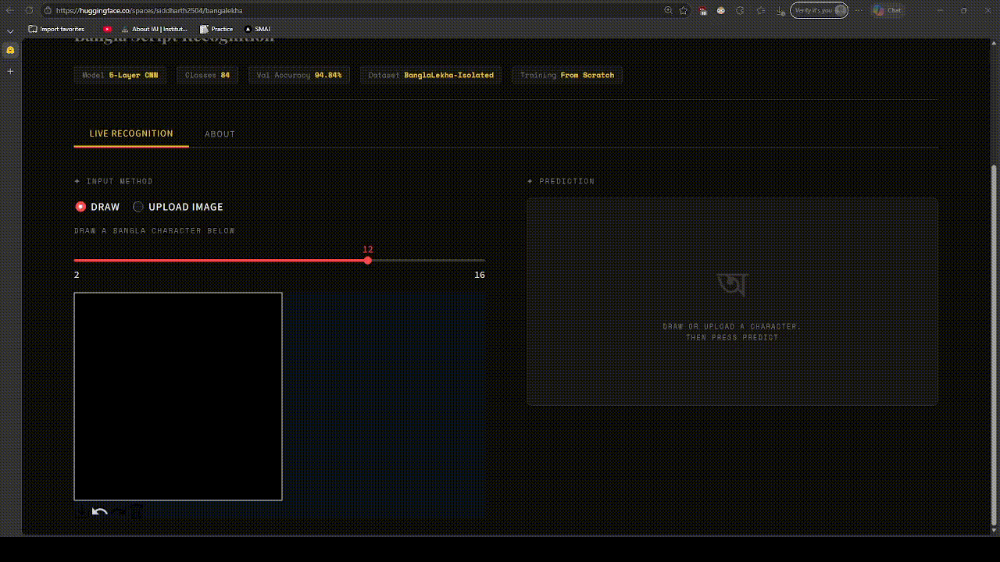

# BanglaLekha Character Recognition

This repository contains the implementation of a custom **Convolutional Neural Network (CNN)** designed to recognize handwritten Bengali characters. Developed for **SMAI Assignment 3**, the project focuses on training a compact, efficient model from scratch using the **BanglaLekha-Isolated** dataset.

---

## 🚀 Live Demo
Experience the real-time recognition system here: 
**[Hugging Face Space](https://huggingface.co/spaces/siddharth2504/bangalekha)**

---

## 📌 Project Overview
* **Model:** Custom 5-layer CNN (<500k parameters).
* **Dataset:** BanglaLekha-Isolated (84 classes, ~166,105 samples).
* **Performance:** **94.84%** validation accuracy on the full 84-class benchmark.
* **Deployment:** Interactive Streamlit application for drawing and real-time Unicode prediction.

---

## 🏗️ Architecture & Training
The model utilizes a custom architecture where depth and regularization were optimized through systematic ablation.

### Model Structure
Each convolutional block follows the pattern:
`Conv(3x3) → BatchNorm → ReLU → MaxPool(2x2)`

Feature maps scale from 32 to 512 channels, followed by **Global Average Pooling (GAP)** and two fully connected layers with **Dropout (p=0.4)**.

### Training Protocol
* **Loss Function:** Cross-entropy.
* **Optimizer:** AdamW ($lr=0.001$, weight decay $= 10^{-4}$).
* **Hardware:** PyTorch DDP on an HPC cluster ($512$ batch size per $GPU \times 4$ GPUs).
* **Scheduling:** Linear warm-up followed by cosine annealing over 40 epochs.

---

## 📊 Ablation Study Results
We investigated four design dimensions to identify the optimal configuration:

| Phase | Variable | Best Value | Best Val. Acc. (%) |
| :--- | :--- | :--- | :--- |
| **1** | Model Depth | **5 Layers** | 94.90% |
| **2** | Augmentation | **Enabled** | 94.84% |
| **3** | Optimizer | **AdamW** | 94.84% |
| **4** | Dropout | **0.4** | 94.84% |

---

## 🏷️ Labeling Methodology
The original dataset lacked Unicode ground-truth labels. We implemented a **two-pass Gemini-assisted verification protocol** to map folder numbers to Bengali graphemes:
1. **Pass 1:** Automated Unicode prediction via Gemini for one representative image per class.
2. **Pass 2:** Independent repetition with fresh, distinct images to detect hallucinations.
3. **Tie-break:** Majority voting for classes where initial passes disagreed (primarily complex conjunct characters).

---

## 📂 Repository Structure
* `main.py`: The **main train script** which includes the custom CNN architecture and the hardcoded Unicode mapping.
* `run.sh`: The **batch run script** used to execute training jobs.
* `app.py`: The Streamlit application code for the interactive demo.
* `FINAL_PRODUCTION_MODEL.pth`: The trained optimal model weights.
* `report.pdf`: The detailed technical report of the project named verbatim.
* `image_aebf79.png`: A dataset sample image named verbatim.
* `confusion_matrix_best.png`: Visualization of model performance showing the diagonal structure of high accuracy.

---

## 📝 References
1. Biswas, M., et al. (2017). "Bangla Lekha-Isolated: A multi-purpose comprehensive dataset..."
2. Chowdhury, R. H., et al. (2026). "BornoViT: A novel efficient Vision Transformer..."

**Team:** The Last Jedi 
**Author:** Siddharth Singh
